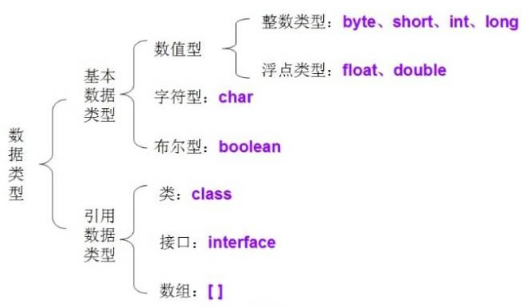

# JAVA汇总
## JAVA基础语法
### 概念：
* 对象：对象是类的一个实例，有状态和行为。例如，一条狗是一个对象，它的状态有：颜色、名字、品种；行为有：摇尾巴、叫、吃等。

* 类：类是一个模板，它描述一类对象的行为和状态。

* 方法：方法就是行为，一个类可以有很多方法。逻辑运算、数据修改以及所有动作都是在方法中完成的。

* 实例变量：每个对象都有独特的实例变量，对象的状态由这些实例变量的值决定。


### 基本语法：
编写 Java 程序时，应注意以下几点：
* 大小写敏感：Java 是大小写敏感的，这就意味着标识符 Hello 与 hello 是不同的。

* 类名：对于所有的类来说，类名的首字母应该大写。如果类名由若干单词组成，那么每个单词的首字母应该大写，例如 MyFirstJavaClass 。

* 方法名：所有的方法名都应该以小写字母开头。如果方法名含有若干单词，则后面的每个单词首字母大写。

* 源文件名：源文件名必须和类名相同。当保存文件的时候，你应该使用类名作为文件名保存（切记 Java 是大小写敏感的），文件名的后缀为 .java。（如果文件名和类名不相同则会导致编译错误）。

* 主方法入口：所有的 Java 程序由 public static void main(String[] args) 方法开始执行。

### 标识符：
Java 所有的组成部分都需要名字。类名、变量名以及方法名都被称为标识符。

关于 Java 标识符，有以下几点需要注意：

* 所有的标识符都应该以字母（A-Z 或者 a-z）,美元符（$）、或者下划线（_）开始

* 首字符之后可以是字母（A-Z 或者 a-z）,美元符（$）、下划线（_）或数字的任何字符组合

* 关键字不能用作标识符

* 标识符是大小写敏感的

* 合法标识符举例：age、$salary、_value、__1_value

* 非法标识符举例：123abc、-salary

### Java修饰符：
像其他语言一样，Java可以使用修饰符来修饰类中方法和属性。主要有两类修饰符：

* 访问控制修饰符 : default, public , protected, private

* 非访问控制修饰符 : final, abstract, static, synchronized

* 在后面的章节中我们会深入讨论 Java 修饰符。

---

<center><font color="red"> - 此处还未讲解到，待学习(2022/06/21) - </font></center>

### Java 变量：
Java 中主要有如下几种类型的变量

* 局部变量

* 类变量（静态变量）

* 成员变量（非静态变量）

### Java 数组：

数组是储存在堆上的对象，可以保存多个同类型变量。在后面的章节中，我们将会学到如何声明、构造以及初始化一个数组。

### Java 枚举：
Java 5.0引入了枚举，枚举限制变量只能是预先设定好的值。使用枚举可以减少代码中的 bug。

例如，我们为果汁店设计一个程序，它将限制果汁为小杯、中杯、大杯。这就意味着它不允许顾客点除了这三种尺寸外的果汁。

实例：
```JAVA
class FreshJuice {
   enum FreshJuiceSize{ SMALL, MEDIUM , LARGE }
   FreshJuiceSize size;
}
 
public class FreshJuiceTest {
   public static void main(String[] args){
      FreshJuice juice = new FreshJuice();
      juice.size = FreshJuice.FreshJuiceSize.MEDIUM  ;
   }
}
```
**注意**：枚举可以单独声明或者声明在类里面。方法、变量、构造函数也可以在枚举中定义。

<center><font color="red"> - 结束 - </font></center>

---


### Java 关键字：

<table class="reference"><tbody><tr><th>类别</th><th>关键字</th><th>说明</th></tr><tr><td rowspan="4"align="center">访问控制</td><td>private</td><td>私有的</td></tr><tr><td>protected</td><td>受保护的</td></tr><tr><td>public</td><td>公共的</td></tr><tr><td>default</td><td>默认</td></tr><tr><td rowspan="13"align="center">类、方法和变量修饰符</td><td>abstract</td><td>声明抽象</td></tr><tr><td>class</td><td>类</td></tr><tr><td>extends</td><td>扩充,继承</td></tr><tr><td>final</td><td>最终值,不可改变的</td></tr><tr><td>implements</td><td>实现（接口）</td></tr><tr><td>interface</td><td>接口</td></tr><tr><td>native</td><td>本地，原生方法（非Java实现）</td></tr><tr><td>new</td><td>新,创建</td></tr><tr><td>static</td><td>静态</td></tr><tr><td>strictfp</td><td>严格,精准</td></tr><tr><td>synchronized</td><td>线程,同步</td></tr><tr><td>transient</td><td>短暂</td></tr><tr><td>volatile</td><td>易失</td></tr><tr><td rowspan="12"align="center">程序控制语句</td><td>break</td><td>跳出循环</td></tr><tr><td>case</td><td>定义一个值以供switch选择</td></tr><tr><td>continue</td><td>继续</td></tr><tr><td>default</td><td>默认</td></tr><tr><td>do</td><td>运行</td></tr><tr><td>else</td><td>否则</td></tr><tr><td>for</td><td>循环</td></tr><tr><td>if</td><td>如果</td></tr><tr><td>instanceof</td><td>实例</td></tr><tr><td>return</td><td>返回</td></tr><tr><td>switch</td><td>根据值选择执行</td></tr><tr><td>while</td><td>循环</td></tr><tr><td rowspan="6"align="center">错误处理</td><td>assert</td><td>断言表达式是否为真</td></tr><tr><td>catch</td><td>捕捉异常</td></tr><tr><td>finally</td><td>有没有异常都执行</td></tr><tr><td>throw</td><td>抛出一个异常对象</td></tr><tr><td>throws</td><td>声明一个异常可能被抛出</td></tr><tr><td>try</td><td>捕获异常</td></tr><tr><td rowspan="2"align="center">包相关</td><td>import</td><td>引入</td></tr><tr><td>package</td><td>包</td></tr><tr><td rowspan="8"align="center">基本类型</td><td>boolean</td><td>布尔型</td></tr><tr><td>byte</td><td>字节型</td></tr><tr><td>char</td><td>字符型</td></tr><tr><td>double</td><td>双精度浮点</td></tr><tr><td>float</td><td>单精度浮点</td></tr><tr><td>int</td><td>整型</td></tr><tr><td>long</td><td>长整型</td></tr><tr><td>short</td><td>短整型</td></tr><tr><td rowspan="3"align="center">变量引用</td><td>super</td><td>父类,超类</td></tr><tr><td>this</td><td>本类</td></tr><tr><td>void</td><td>无返回值</td></tr><tr><td rowspan="3"align="center">保留关键字</td><td>goto</td><td>是关键字，但不能使用</td></tr><tr><td>const</td><td>是关键字，但不能使用</td></tr></tbody></table>

**注意**：Java 的 null 不是关键字，类似于 true 和 false，它是一个字面常量，不允许作为标识符使用。

### 继承：
在 Java 中，一个类可以由其他类派生。如果你要创建一个类，而且已经存在一个类具有你所需要的属性或方法，那么你可以将新创建的类继承该类。

利用继承的方法，可以重用已存在类的方法和属性，而不用重写这些代码。被继承的类称为超类（super class），派生类称为子类（sub class）。

### 接口：
在 Java 中，接口可理解为对象间相互通信的协议。接口在继承中扮演着很重要的角色。

接口只定义派生要用到的方法，但是方法的具体实现完全取决于派生类。

### Java 源程序与编译型运行区别：

如下图所示：


<br>

## JAVA数据类型

### 分类：

Java 语言的数据类型分为两种：基本数据类型和引用数据类型。

(1) 基本数据类型包括 boolean（布尔型）、float（单精度浮点型）、char（字符型）、byte（字节型）、short（短整型）、int（整型）、long（长整型）和 double （双精度浮点型）共 8 种，详见表 1 所示。


<table><caption>表1 Java的基本数据类型</caption><tbody><tr><th>类型名称</th><th>关键字</th><th>占用内存</th><th>取值范围</th></tr><tr><td>字节型</td><td>byte</td><td>1字节</td><td>-128~127</td></tr><tr><td>短整型</td><td>short</td><td>2字节</td><td>-32768~32767</td></tr><tr><td>整型</td><td>int</td><td>4字节</td><td>-2147483648~2147483647</td></tr><tr><td>长整型</td><td>long</td><td>8字节</td><td>-9223372036854775808L~9223372036854775807L</td></tr><tr><td>单精度浮点型</td><td>float</td><td>4字节</td><td>+/-3.4E+38F（6~7个有效位）</td></tr><tr><td>双精度浮点型</td><td>double</td><td>8字节</td><td>+/-1.8E+308(15个有效位）</td></tr><tr><td>字符型</td><td>char</td><td>2字节</td><td>ISO单一字符集</td></tr><tr><td>布尔型</td><td>boolean</td><td>1字节</td><td>true或false</td></tr></tbody></table>

(2) 引用数据类型建立在基本数据类型的基础上，包括数组、类和接口。引用数据类型是由用户自定义，用来限制其他数据的类型。另外，Java 语言中不支持 C++ 中的指针类型、结构类型、联合类型和枚举类型。



<font color="brown">基本数据类型又可分为 4 大类，即整数类型（包括 byte、short，int 和 long）、浮点类型（包括 float 和 double）、布尔类型和字符类型（char）</font>，下面分别介绍这 4 大类数据类型：

### 整数类型

<font color="brown">Java 定义了 4 种整数类型变量：字节型（byte）、短整型（short）、整型（int）和长整型（long）</font>。这些都是有符号的值，正数或负数。

**字节型（byte）**

byte 类型是最小的整数类型。当用户从网络或文件中处理数据流时，或者处理可能与 Java 的其他内置类型不直接兼容的未加工的二进制数据时，该类型非常有用。


**短整型（short）**

short 类型限制数据的存储为先高字节，后低字节，这样在某些机器中会出错，因此该类型很少被使用。


**整型（int）**

int 类型是最常使用的一种整数类型。


**长整型（long）**

对于大型程序常会遇到很大的整数，当超出 int 类型所表示的范围时就要使用 long 类型。


<br>

*例 1*

创建一个 Java 程序，在 main() 方法中声明各种整型的变量并赋予初值，最后将变量相加并输出结果，代码如下：

```java
public static void main(String[] args) {
    byte a = 20; // 声明一个byte类型的变量并赋予初始值为20
    short b = 10; // 声明一个short类型的变量并赋予初始值为10
    int c = 30; // 声明一个int类型的变量并赋予初始值为30
    long d = 40; // 声明一个long类型的变量并赋予初始值为40
    long sum = a + b + c + d;
    System.out.println("20+10+30+40=" + sum);
}
```
输出的最终结果为：20+10+30+40=100

在该示例中，首先依次定义了 byte 类型、short 类型、int 类型和 long 类型的 4 个变量，并赋予了初始值，然后定义了一个 long 类型、名称为 sum 的变量。sum 变量的值为前 4 个变量之和，最后输出 sum 变量的值，即相加之后的结果。

提示：因为 byte 类型、short 类型、int 类型和 long 类型都是整数类型，故可以使用“+”相加，而非字符串之间的连接。

### 浮点类型

浮点类型是带有小数部分的数据类型，也叫实型。浮点型数据包括单精度浮点型（float）和双精度浮点型（double），代表有小数精度要求的数字。

单精度浮点型（float）和双精度浮点型（double）之间的区别主要是所占用的内存大小不同，float 类型占用 4 字节的内存空间，double 类型占用 8 字节的内存空间。双精度类型 double 比单精度类型 float 具有更高的精度和更大的表示范围。

Java 默认的浮点型为 double，例如，11.11 和 1.2345 都是 double 型数值。如果要说明一个 float 类型数值，就需要在其后追加字母 f 或 F，如 11.11f 和 1.2345F 都是 float 类型的常数。

例如，可以使用如下方式声明 float 类型的变量并赋予初值。

`float price = 12.2f; // 定义float类型并赋予初值`

也可以使用如下的任意一种方式声明 double 类型的变量并赋予初值。

`double price = 12.254d; // 定义double类型的变量并赋予初值`

或

`double price = 12.254; // 定义double类型的变量并赋予初值`

**注意：**<font color="brown">一个值要能被真正看作 float，它必须以 f（或 F）后缓结束；否则，会被当作 double 值。对 double 值来说，d（或 D）后缓是可选的。</font>


<br>

*例 2*

假设从 A 地到 B 地路程为 2348.4 米，那么往返 A 和 B 两地需要走多少米？

由于路径数据为浮点类型，在这里定义一个类型为 double 的变量来存储单程距离，并定义一个 int 类型的变量来存储次数。另外，因为计算得到的值为 float 类型，所以可以定义一个 float 类型的变量来存储总距离。

代码如下：
```java
public static void main(String[] args) {
    double lutu = 2348.4; // 定义 double 类型的变量，用于存储单程距离
    int num = 2; // 定义 int 类型的变量，用于存储次数
    float total = (float) (lutu * 2); // 定义 float 类型的变量，用于存储总距离
    System.out.println("往返 AB 两地共需要行驶：" + total + " 米");
}
```

输出结果为：往返 AB 两地共需要行驶：4696.8米

该示例中首先定义了一个类型为 double、名称为 lutu 的变量用于存储单程距离，然后定义了一个类型为 int、名称为 num 的变量用于存储经过的次数，最后定义了一个类型为 float、名称为 total 的变量用于存储总距离。

其实一个 double 类型的数据与一个 int 类型的数据相乘后得到的结果类型为 double，但是由于单程距离乘以次数为一个单精度浮点型（float 类型）的数，因此可以将总距离转换为 float 类型的数据。

### 布尔类型

布尔类型（boolean）用于对两个数值通过逻辑运算，判断结果是“真”还是“假”。Java 中用保留字 true 和 false 来代表逻辑运算中的“真”和“假”。因此，一个 boolean 类型的变量或表达式只能是取 true 和 false 这两个值中的一个。

<font color="brown">在 Java 语言中，布尔类型的值不能转换成任何数据类型，true 常量不等于 1，而 false 常量也不等于 0。这两个值只能赋给声明为 boolean 类型的变量，或者用于布尔运算表达式中。</font>

例如，可以使用以下语句声明 boolean 类型的变量。

```java
boolean isable;    // 声明 boolean 类型的变量 isable
boolean b = false;    // 声明 boolean 类型的变量 a，并赋予初值为 false
```

### 字符类型

Java 语言中的字符类型（char）使用两个字节的 Unicode 编码表示，它支持世界上所有语言，可以使用单引号字符或者整数对 char 型赋值。

一般计算机语言使用 ASCII 编码，用一个字节表示一个字符。ASCII 码是 Unicode 码的一个子集，用 Unicode 表示 ASCII 码时，其高字节为 0，它是其前 255 个字符。

Unicode 字符通常用十六进制表示。例如“\u0000”~“\u00ff”表示 ASCII 码集。“\u”表示转义字符，它用来表示其后 4 个十六进制数字是 Unicode 码。

字符型变量的类型为 char，用来表示单个的字符，例如：

```java
char letter = 'D';
char numChar = '5';
```

第一条语句将字符 D 赋给字符型变量 letter；第二条语句将数字字符 5 赋给字符型变量 numChar。


<br>

*例 3*

下面代码在 main() 方法中定义两个字符类型的变量，并使之相对应的 ASCII（Unicode）值相加，最后将相加后的结果输出。

```java
public static void main(String[] args) {
    char a = 'A';    // 向 char 类型的 a 变量赋值为 A，所对应的 ASCII 值为 65
    char b = 'B';    // 向 char 类型的 b 变量赋值为 B，所对应的 ASCII 值为 66
    System.out.println("A 的 ASCII 值与 B 的 ASCII 值相加结果为："+(a+b));
}
```
输出结果为：A的ASCII值与B的ASCII值相加结果为：131

在该程序中，a 变量首先被赋值为“A”，字母 A 在 ASCII（和 Unicode）中对应的值为 65。接着又定义了一个类型为 char 的变量 b，赋值为“B”，字母 B 在 ASCII（和 Unicode）中所对应的值为 66。因此相加后得出的结果为 131。

提示：字符通常用 16 进制表示，范围从“\uOOOO” ~ “ \ uFFFF ” ， 即从 0~65535。\uOOOO 和 \uFFFF 中的 u 告诉编译器是用两个字节（16 位）字符信息表示一个 Unicode 字符。